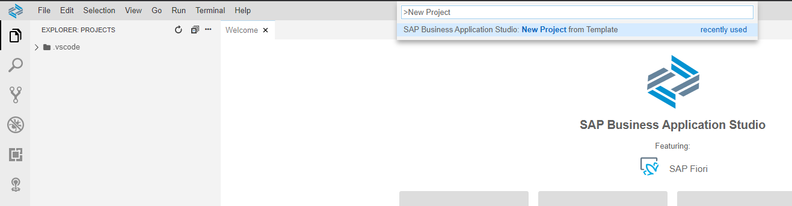
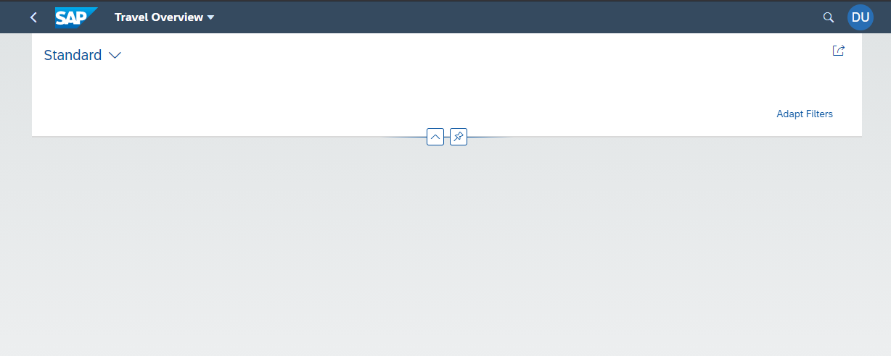
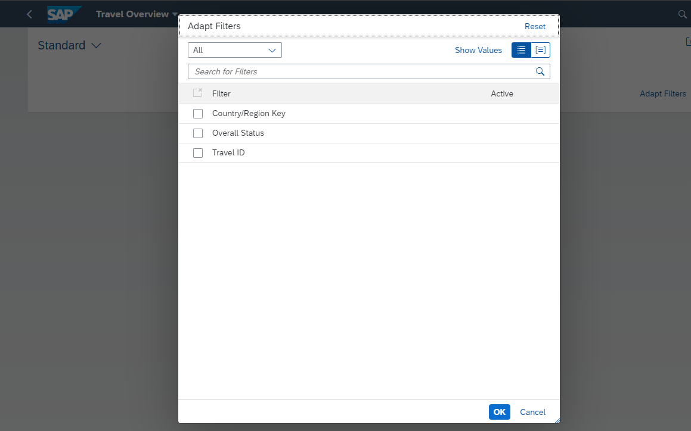
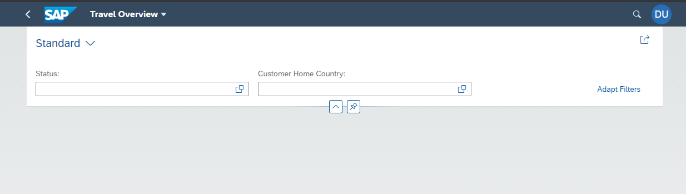
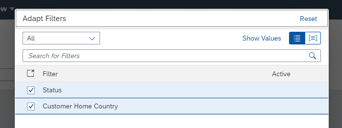
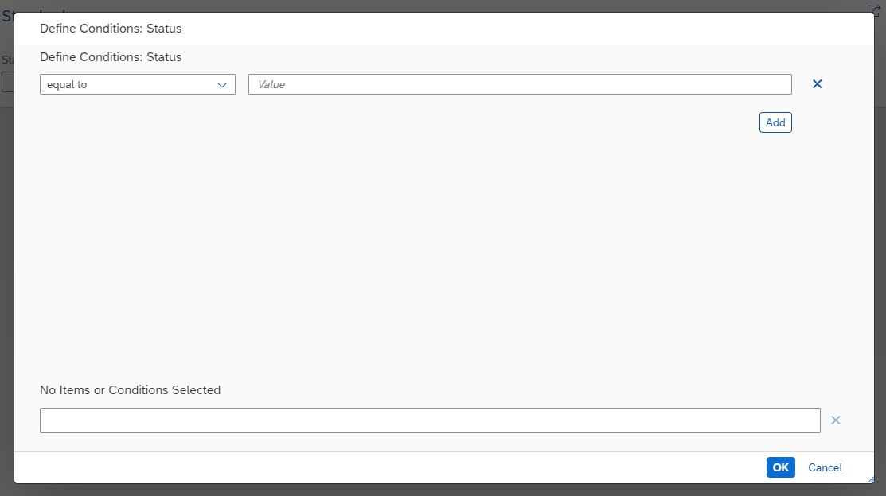
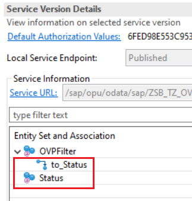
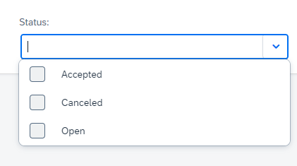
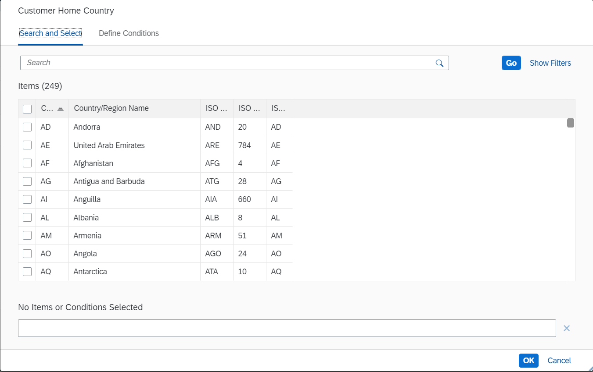

# 1. Create initial Overview Page

### 1. Create the Interface CDS View Entity ZRAPH_##_I_OVPFilter
This CDS View Entity (together with its consumption view) represents the filter options for the Overview Page.  
We want to filter for the overall status and customers home country.  
  
As primary source for the CDS View Entity we use ZRAPH\_##\_I\_TravelWDTP.  
To get access to the customers home country, we need the data of /DMO/I_Customer.  
This view entity could be joined in here, but we already have an association to it defined and exposed in ZRAPH\_##\_I\_TravelWDTP.  
So, find and use this association.  
We want to alias this country field because we are placing it in another context now (see Field name in below table).  
  
Following fields need to be put in the projection list:  

| Source                                | Field name          | Is key |
| ------------------------------------- | ------------------- | ------ |
| ZRAPH_##_I_TravelWDTP.TravelID        | TravelID            | Yes    |
| ZRAPH_##_I_TravelWDTP.OverallStatus   | OverallStatus       | No     |
| "association_to_customer".CountryCode | CustomerHomeCountry | No     |
  
[__Solution__](./solutions/CreateInitialOVP/ZRAPH_%23%23_I_OVPFilter-1.txt)

### 2. Create the Consumption CDS View Entity ZRAPH_##_C_OVPFilter
This CDS View Entity adds annotations for the filtering of the OVP.  
It shall be created as a selection from ZRAPH\_##\_I\_OVPFilter and projects all of its fields.  
  
[__Solution__](./solutions/CreateInitialOVP/ZRAPH_%23%23_C_OVPFilter-1.txt)

### 3. Create the service definition ZRAPH_##_SD_OVP
Expose the following entity:  

| CDS View Entity      | Entity Set |
| -------------------- | ---------- |
| ZRAPH_##_C_OVPFilter | OVPFilter  |
  
[__Solution__](./solutions/CreateInitialOVP/ZRAPH_%23%23_SD_OVP-1.txt)

### 4. Create the service binding ZRAPH_##_SB_OVP and publish it
Use service definition ZRAPH\_##\_SD\_OVP.  
Use Binding Type: OData V2 - UI.  

### 5. Create Overview Page in Business Application Studio and test it

#### Open the Business Application Studio (BAS).  
Before creating the SAP Overviewpage application, make sure that the Install SAP Business Application Studio from the Installation Guide is successfully completed and your SAP Business Application Studio is connected to Cloud Foundry.  

#### Create new project
Click on "Start from template" in the "Welcome"-Tab.  
  
Or press CTRL+SHIFT+P and type "New Project" and select the item "SAP Business Application Studio: New Project from Template".  
  
Choose "SAP Fiori Application" and press the "Start" button below.  
  
As Application type, take "SAP Fiori Elements".  
Press on "Overview Page" and press the "Next" button below.  
  
As data source choose "Connect to a System".  
As system choose your destination, created in previous lessons.  
As service choose the service ZRAPH\_##\_SB\_OVP, that you published earlier.  
Press the "Next" button below.  
  
As filter entity choose the entity OVPFilterType (The "Type" part was added automatically by the system for the OData Service) we defined in the service definition.  
Press the "Next" button below.  
  
As module name choose "travel_ovp_##".  
As application title choose "Travel Overview".  
As namespace choose "com.erp.ovp".  
As description choose "Travel Overview".  
Leave the project folder path at "/home/user/projects".  
Leave the minimum SAPUI5 version as it is proposed.  
Also leave all 3 radio buttons at "No".  
Press the "Finish" button below.  
  
At the left in the project explorer you see a new folder "travel\_ovp\_##".  
  

#### Test the application
Press CTRL+SHIFT+P and type "Preview App" and select the item "Fiori: Preview Application" and choose the first script "start".  
  
  
Your app should now look like this:  
  
  
If you press on "Adapt Filters", the 3 fields we defined in the Consumption View Entity should be visible.  
  

### 6. Add filter fields to filter bar and rename them
This is not how we want our filter bar to look.  
We want to have the filter fields available directly on the filter bar without needing to adapt them.  
Also we want other labels and not show the travel id at all.  
Therefore we add the following annotations to ZRAPH\_##\_C\_OVPFilter:  
  
__TravelID:__
```abap
@UI.hidden: true
```
__OverallStatus:__
```abap
@UI.selectionField: [{ position: 1 }]
@EndUserText.label: 'Status'
```
__CustomerHomeCountry:__
```abap
@UI.selectionField: [{ position: 2 }]
@EndUserText.label: 'Customer Home Country'
```
  
After activating ZRAPH_##_C_OVPFilter again, we test our app once more (if you have the app still open, reloading it suffices) and it should look like this:  
  
  
  
However when pressing the value help button, only a generic popup shows up.  
  
  
[__Solution__](./solutions/CreateInitialOVP/ZRAPH_%23%23_C_OVPFilter-2.txt)

### 7. Add useful value helps for the filter fields
  
#### Reexpose associations to the status and country in ZRAPH_##_I_OVPFilter
We need associations with targets /DMO/I\_Overall_Status_VH and I_Country.  
Fortunatelly in ZRAPH\_##\_I\_TravelWDTP we already defined an association to Overall Status.  
Additionally we already have an association to /DMO/I_Customer, which in turn associates to I_Country.  
Therefore we can simply reexpose those associations by adding them to the projection list of the CDS View Entity.  
We want to alias them, though:  
_OverallStatus as _Status and _Customer._Country as _Country.  
  
Activate ZRAPH\_##\_I\_OVPFilter.  
  
[__Solution__](./solutions/CreateInitialOVP/ZRAPH_%23%23_I_OVPFilter-2.txt)
  
#### Expose the new association in the consumption view ZRAPH_##_C_OVPFilter
Add the associations to the projection list.  
Add the following annotations to fields OverallStatus and CustomerHomeCountry of ZRAPH\_##\_C\_OVPFilter:  
  
__OverallStatus:__  

```abap
@Consumption.valueHelpDefinition: [{entity: { name:    '/DMO/I_Overall_Status_VH',
                                              element: 'OverallStatus' } }]
```
  
__CustomerHomeCountry:__  
  
```abap
@Consumption.valueHelpDefinition: [{entity: { name:    'I_Country',
                                              element: 'Country' } }]
```
  
Activate ZRAPH\_##\_C\_OVPFilter.  
  
Check the service binding ZRAPH\_##\_SB\_OVP.  
It should now include the following new lines:  
  
  
Again check the app. Press the value help for both filters. It should now look like this:  

  
  
[__Solution__](./solutions/CreateInitialOVP/ZRAPH_%23%23_C_OVPFilter-3.txt)
  
  
[Next Step >>](./2_AddTableCard.md)