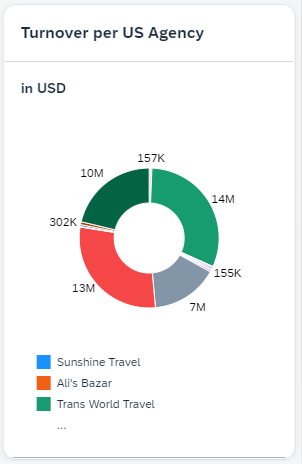
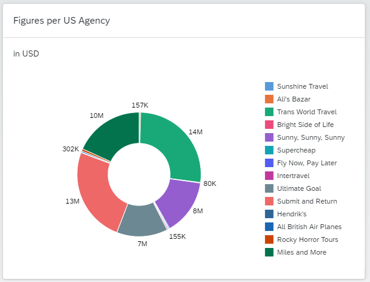

# Add an analytical card to the Overview Page

### 1. Create CDS View Entity ZRAPH_##_I_OVPFigureDevelopmnt
Base this new view entity on ZRAPH_I_TravelWDTP.  

| Source                                    | Field name          | Is key |
| ----------------------------------------- | ------------------- | ------ |
| *ZRAPH_##_I_TravelWDTP.*AgencyID          | AgencyID            | Yes    |
| *ZRAPH_##_I_TravelWDTP.*CurrencyCode      | CurrencyCode        | No     |
| sum(*ZRAPH_##_I_TravelWDTP.*total_price)  | Price               | No     |
| _Agency.Name                              | AgencyName          | No     |
  
*AgencyID, CurrencyCode and _Agency.Name need to be added to a group by clause*  
"CurrencyCode" shall set as the currency for "Price".  
Add a where-clause to only include US agencies (_Agency.CountryCode = 'US')  
  
Activate ZRAPH_##_I_OVPFigureDevelopmnt.  
  
[__Solution__](./solutions/AddAnalyticalCard/ZRAPH_%23%23_I_OVPFigureDevelopmnt.txt)  

### 2. Create CDS View Entity ZRAPH_##_C_OVPFigureDevelopmnt
Base this new view entity on ZRAPH_##_I_OVPFigureDevelopmnt.  
Include all 4 fields of the base view entity.  
  
Add the following annotations to provide the metadata for the view entity:  
  
__To the view entity itself__  
```abap
@UI.chart: [
  {
    qualifier: 'Donut',
    title: 'in USD',
    chartType: #DONUT,
    dimensions: ['AgencyName'],
    measures: ['Price'],    
    measureAttributes: [
      {
        measure: 'Price',
        role: #AXIS_1
      }
    ],
    dimensionAttributes: [
        {
          dimension: 'AgencyName',
          role: #CATEGORY
        }
    ]
  }
]
```
  
[__Solution__](./solutions/AddAnalyticalCard/ZRAPH_%23%23_C_OVPFigureDevelopmnt.txt)  

### 3. Expose ZRAPH_##_C_OVPFigureDevelopmnt as entity set
Adapt ZRAPH_##_SD_OVP:  

| CDS View Entity                | Entity Set        |
| ------------------------------ | ----------------- |
| ZRAPH_##_C_OVPFigureDevelopmnt | FigureDevelopment |
  
Activate ZRAPH_##_SD_OVP.  
  
[__Solution__](./solutions/AddAnalyticalCard/ZRAPH_%23%23_SD_OVP.txt)  
  
### 4. Add list card to OVP
  
#### Configure the card

In BAS open file webapp/manifest.json and scroll down to section "sap.ovp".  
Enhance the already existing "cards : {}" entry with the following:  
```json
"card04": {
    "model": "mainService",
    "template": "sap.ovp.cards.charts.analytical",
    "settings": {
        "title": "{{card04_title}}",
        "entitySet": "FigureDevelopment",
        "chartAnnotationPath": "com.sap.vocabularies.UI.v1.Chart#Donut"
    }
}
```
  
[__Solution__](./solutions/AddAnalyticalCard/manifest.json)  
  
#### Define the translatable title text

In BAS open file webapp/i18n/i18n.properties.  
Add the card title as follows:  
```properties
#XTIT: Analytical Card
card04_title=Figures per US Agency
```
  
[__Solution__](./solutions/AddAnalyticalCard/i18n.properties)  
  
#### Test the app once more
In BAS again test the App.  
The new card should look similar to this:  
  
  
### 5. Set default size of the card
As we now cannot see much of the legend, describing the sections of the chart, we want to enlarge the card by default.  
In BAS open file webapp/manifest.json and scroll down to section "sap.ovp".  
  
Enhance the settings section of the analycitcal card entry with the following:  
```json
"defaultSpan": {
    "rows": 0,
    "cols": 2
}
```
  
In BAS again test the App.  
The analytical card should now look similar to this:  
  
  
  
[<< Previous Step](./AddLinkListCard.md)