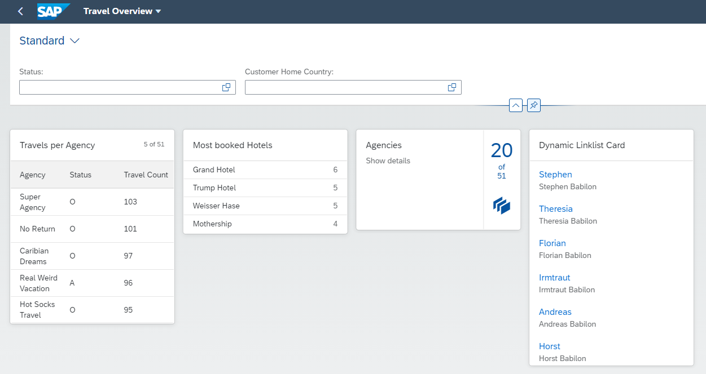
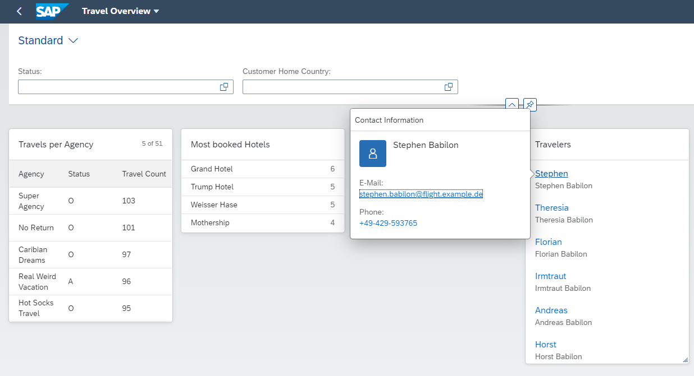

# Add a link list card to the Overview Page

### 1. Create a CDS View Entity ZRAPH_##_C_OVPTraveler
Base this new view entity on /dmo/customer.  
  
| Source                                      | Field name   | Is key |
| ------------------------------------------- | ------------ | ------ |
| customer_id                                 | TravelerID   | Yes    |
| first_name                                  | FirstName    | No     |
| last_name                                   | LastName     | No     |
| concat_with_space(first_name, last_name, 1) | FullName     | No     |
| email_address                               | EMailAddress | No     |
| phone_number                                | PhoneNumber  | No     |
  
Add the following annotations to provide the metadata for the view entity:  
  
__To the view entity itself__
```abap
@UI.headerInfo: {
  typeName: 'Traveler',
  typeNamePlural: 'Travelers',
  title: {
    label: 'First Name',
    value: 'FirstName',
    type: #STANDARD
  },
  description: {
    label: 'Name',
    value: 'FullName',
    type: #STANDARD
  }
}
```
  
__FullName:__  
```abap
@Semantics.name.fullName: true
```
  
__EMailAddress:__  
```abap
@Semantics.eMail.address: true
@Semantics.eMail.type:  [#WORK, #PREF]
```
  
__PhoneNumber:__  
```abap
@Semantics.telephone.type:  [ #PREF , #WORK]
```
  
Activate ZRAPH_##_C_OVPTraveler.  
  
[__Solution__](./solutions/AddLinkListCard/ZRAPH_%23%23_C_OVPTraveler.txt)  
  
### 2. Expose ZRAPH_##_C_OVPTraveler as entity set
Adapt ZRAPH_##_SD_OVP:  

| CDS View Entity        | Entity Set |
| ---------------------- | ---------- |
| ZRAPH_##_C_OVPTraveler | Traveler   |
  
Activate ZRAPH_##_SD_OVP.  
  
[__Solution__](./solutions/AddLinkListCard/ZRAPH_%23%23_SD_OVP.txt)  
  
### 3. Add list card to OVP

#### Configure the card

In BAS open file webapp/manifest.json and scroll down to section "sap.ovp".  
Enhance the already existing "cards : {}" entry with the following:  
```json
"card03": {
    "model": "mainModel",
    "template": "sap.ovp.cards.linklist",
    "settings": {
        "title": "{{card03_title}}",
        "subtitle": "{{card03_subtitle}}",
        "listFlavor": "standard",
        "entitySet": "Traveler",
        "sortBy": "LastName",
        "sortOrder": "ascending",
        "headerAnnotationPath": "com.sap.vocabularies.UI.v1.HeaderInfo",
        "identificationAnnotationPath": "com.sap.vocabularies.UI.v1.Identification"
    }
}
```
  
[__Solution__](./solutions/AddLinkListCard/manifest.json)  
  
#### Define the translatable title text

In BAS open file webapp/i18n/i18n.properties.  
Add the card title as follows:  
```properties
#XTIT: Link List Title
card03_title=Traveler

#XTIT: Link List Title
card03_subtitle=All
```
  
[__Solution__](./solutions/AddLinkListCard/i18n.properties)  
  
#### Test the app once more
In BAS again test the App.  
It should now look similar to this:  

  
  

[<< Previous Step](./AddStackCard.md) | [Next Step >>](./AddAnalyticalCard.md)
