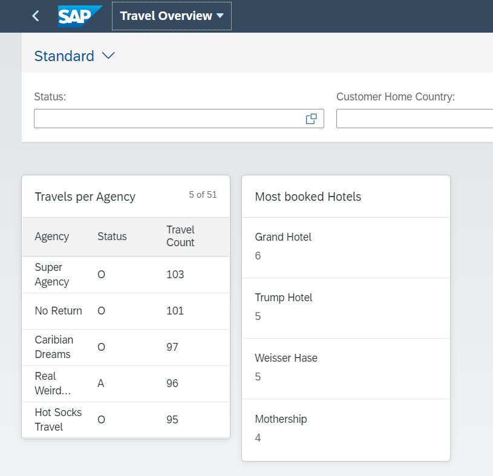
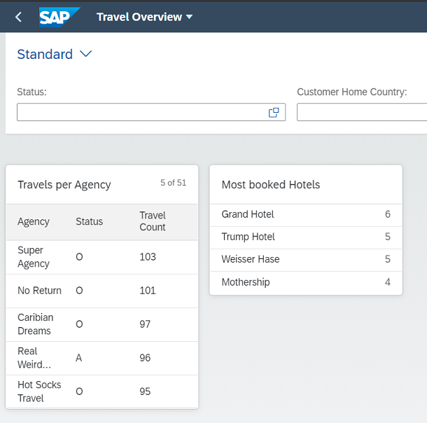

# Add a list card to the Overview Page

### 1. Create CDS View Entity ZRAPH_##_C_OVPMostBookedHotels
Base this new view entity on ZRAPH_##_I_RoomReservationWDTP.  
  
| Source                          | Field name        | Is key |
| ------------------------------- | ----------------- | ------ |
| *ZRAPH_##_I_TravelWDTP.*HotelID | HotelID           | Yes    |
| _Hotel.name                     | HotelName         | No     |
| count( * )                      | ReservationsCount | No     |
  
Add the following annotations to provide the metadata for the view entity:  
  
__To the view entity itself__
```abap
@UI.presentationVariant: [
  { qualifier: 'List', 
    sortOrder: [{
        by:       'ReservationsCount', 
        direction :#DESC 
      }]}
]
```
  
__HotelName:__  
```abap
@UI.lineItem: [{
    qualifier: 'List',
    label: 'Hotel',
    position : 1
}]
```
  
__ReservationsCount:__  
```abap
@UI.lineItem: [{
    qualifier: 'List',
    label: 'Reservation Count',
    position : 2
}]
```
  
Activate ZRAPH_##_C_OVPMostBookedHotels.  
  
[__Solution__](./solutions/AddListCard/ZRAPH_%23%23_C_OVPMostBookedHotels-1.txt)  
  
### 2. Expose ZRAPH_##_C_OVPMostBookedHotels as entity set
Adapt ZRAPH_##_SD_OVP:  

| CDS View Entity                | Entity Set       |
| ------------------------------ | ---------------- |
| ZRAPH_##_C_OVPMostBookedHotels | MostBookedHotels |
  
Activate ZRAPH_##_SD_OVP.  
  
[__Solution__](./solutions/AddListCard/ZRAPH_%23%23_SD_OVP.txt)  
  
### 3. Add list card to OVP

#### Configure the card

In BAS open file webapp/manifest.json and scroll down to section "sap.ovp".  
Enhance the already existing "cards : {}" entry to with following:  
```json
"card01": {
    "model": "mainService",
    "template": "sap.ovp.cards.list",
    "settings": {
        "title": "{{card01_title}}",
        "entitySet": "MostBookedHotels",
        "addODataSelect": false,
        "presentationAnnotationPath": "com.sap.vocabularies.UI.v1.PresentationVariant#List",
        "annotationPath": "com.sap.vocabularies.UI.v1.LineItem#List"
    }
}
```
  
[__Solution__](./solutions/AddListCard/manifest.json)  
  
#### Define the translatable title text

In BAS open file webapp/i18n/i18n.properties.  
Add the card title as follows:  
```properties
#XTIT: Table Card Title
card01_title=Most booked Hotels
```
  
[__Solution__](./solutions/AddListCard/i18n.properties)  
  
#### Test the app once more
In BAS again test the App.  
It should now look similar to this:  
  
  
### 4. Format the card

#### Change the annotations of ZRAPH_##_C_OVPMostBookedHotels  
  
__ReservationsCount (add "type" to @UI.lineItem and @UI.dataPoint as a whole):__  
```abap
@UI.lineItem: [{
    qualifier: 'List',
    type: #AS_DATAPOINT,
    label: 'Reservation Count',
    position : 2
}]
@UI.dataPoint: {
    title: 'Reservation Count'
}
```
  
[__Solution__](./solutions/AddListCard/ZRAPH_%23%23_C_OVPMostBookedHotels-2.txt)  
  
#### Test the app once more
In BAS again test the App.  
It should now look similar to this:  
  
  
  
[<< Previous Step](./AddTableCard.md) | [Next Step >>](./AddStackCard.md)
