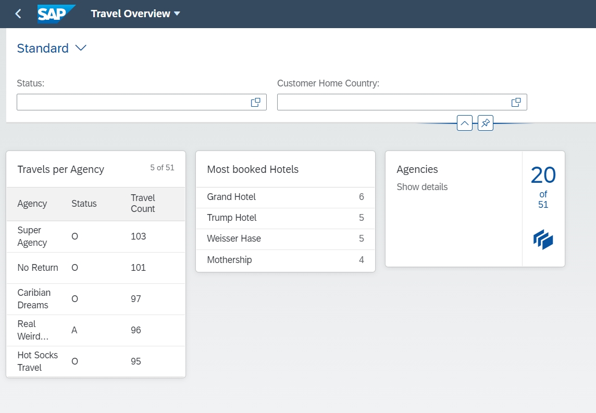
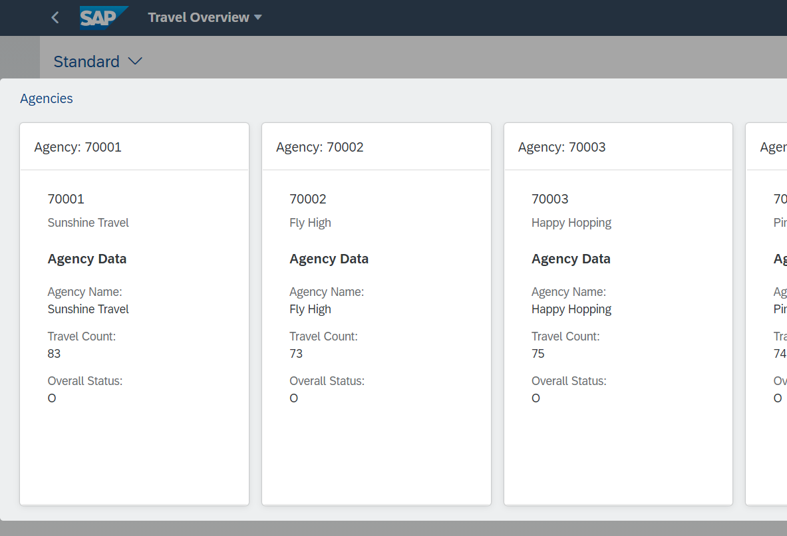

# Add a stack card to the Overview Page
  
### 1. Add annotations to CDS View Entity ZRAPH_##_C_OVPTravelsPerAg
Add the following annotations to provide the metadata for the view entity:  
  
__To the view entity itself__
```abap
@UI.headerInfo: {
  typeName: 'Agency',
  typeNamePlural: 'Agencies',
  title: {
    value: 'AgencyID',
    type: #STANDARD
  },
  description: {
    value: 'AgencyName',
    type: #STANDARD
  }
}
```
  
__AgencyID:__  
```abap
@UI.facet: [
    { isSummary:        true,
        label:            'Agency',
        type:             #FIELDGROUP_REFERENCE,
        targetQualifier:  'AgencyData',
        purpose:          #STANDARD,
        qualifier:        'Stack' }]
```
  
__AgencyName:__  
```abap
@UI.fieldGroup: [
    { qualifier:  'AgencyData',
        type:       #STANDARD,
        groupLabel: 'Agency Data' ,
        label:      'Agency Name',
        position:   1 }]
```
  
__OverallStatus:__  
```abap
@UI.fieldGroup: [
    { qualifier:  'AgencyData',
        label:      'Overall Status',
        position:   2 }]
```
  
__TravelsCount:__  
```abap
@UI.fieldGroup: [
    { qualifier:  'AgencyData',
        label:      'Travel Count',
        position:   2 }]
```
  
Activate ZRAPH_##_C_OVPTravelsPerAg.  
  
[__Solution__](./solutions/AddStackCard/ZRAPH_%23%23_C_OVPTravelsPerAg.txt)  
  
### 2. Add stack card to OVP

#### Configure the card

In BAS open file webapp/manifest.json and scroll down to section "sap.ovp".  
Enhance the already existing "cards : {}" entry to the following:  
```json
"card02": {
    "model": "mainService",
    "template": "sap.ovp.cards.stack",
    "settings": {
        "title": "{{card02_title}}",
        "subTitle": "{{card02_subtitle}}",
        "itemText": "{{card02_itemtext}}",
        "entitySet": "TravelsPerAgency",
        "objectStreamCardsSettings": {
            "annotationPath": "com.sap.vocabularies.UI.v1.Facets#Stack"
        }
    }
}
```
  
[__Solution__](./solutions/AddStackCard/manifest.json)  
  
#### Define the translatable title text

In BAS open file webapp/i18n/i18n.properties.  
Add the card title as follows:  
```properties
#XTIT: Stack Card Title
card02_title=Agencies

#XTIT: Stack Card Title
card02_subtitle=Show details

#XTIT: Stack Card Item Text
card02_itemtext=Agency
```
  
[__Solution__](./solutions/AddStackCard/i18n.properties)  
  
#### Test the app once more
In BAS again test the App.  
It should now look similar to this:  

  
  

[<< Previous Step](./AddListCard.md) | [Next Step >>](./AddLinkListCard.md)
