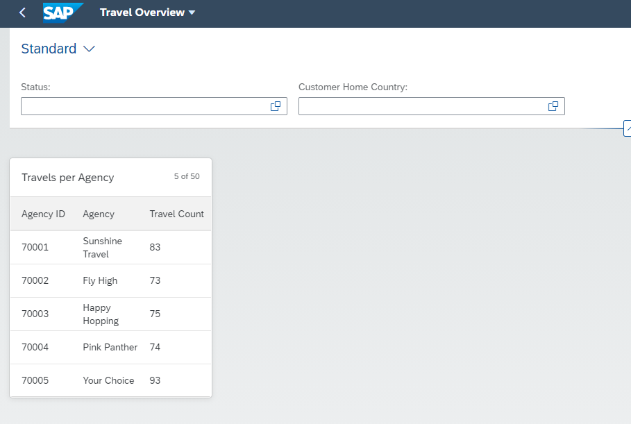

# Add a table card to the Overview Page

### 1. Create CDS View Entity ZRAPH_##_C_OVPTravelsPerAg
Base this new view entity on ZRAPH_##_I_TravelWDTP.  

| Source                              | Field name          | Is key |
| ----------------------------------- | ------------------- | ------ |
| *ZRAPH_##_I_TravelWDTP.*AgencyID    | AgencyID            | Yes    |
| _Agency.Name                        | AgencyName          | No     |
| count( * )                          | TravelsCount        | No     |
  
*AgencyID and _Agency.Name need to be added to a group by clause*  
  
Add the following annotations to provide the metadata for the table:  
  
__AgencyID:__
```abap
@UI.lineItem: [{
    qualifier: 'Table',
    label: 'Agency ID',
    position : 1
}]
```
__AgencyName:__
```abap
@UI.lineItem: [{
    qualifier: 'Table',
    label: 'Agency',
    position : 2
}]
```
__CustomerHomeCountry:__
```abap
@UI.lineItem: [{
    qualifier: 'Table',
    label: 'Travel Count',
    position : 3
}]
```
  
Activate ZRAPH_##_C_OVPTravelsPerAg.  
  
[__Solution__](./solutions/AddTableCard/ZRAPH_%23%23_C_OVPTravelsPerAg.txt)

### 2. Expose ZRAPH_##_C_OVPTravelsPerAg as entity set
Adapt ZRAPH_##_SD_OVP:  

| CDS View Entity            | Entity Set       |
| -------------------------- | ---------------- |
| ZRAPH_##_C_OVPTravelsPerAg | TravelsPerAgency |
  
Activate ZRAPH_##_SD_OVP.  
  
[__Solution__](./solutions/AddTableCard/ZRAPH_%23%23_SD_OVP.txt)

### 3. Add table card to OVP

#### Configure the card

In BAS open file webapp/manifest.json and scroll down to section "sap.ovp".  
Enhance the already existing "cards : {}" entry to the following:  
```json
        "cards": {
            "card00": {
                "model": "mainService",
                "template": "sap.ovp.cards.table",
                "settings": {
                    "title": "{{card00_title}}",
                    "entitySet": "TravelsPerAgency",
                    "addODataSelect": false,
                    "presentationAnnotationPath": "com.sap.vocabularies.UI.v1.PresentationVariant#Table",
                    "annotationPath": "com.sap.vocabularies.UI.v1.LineItem#Table"
                }
            }
        }
```
  
[__Solution__](./solutions/AddTableCard/manifest.json)  
  
#### Define the translatable title text

In BAS open file webapp/i18n/i18n.properties.  
Add the card title as follows:  
```properties
#XTIT: Table Card Title
card00_title=Travels per Agency
```
  
[__Solution__](./solutions/AddTableCard/i18n.properties)  

### 4. Test the app once more
In BAS again test the App.  
It should now look similar to this:  
  
  
  
[<< Previous Step](./CreateInitialOVP.md) | [Next Step >>](./AddListCard.md)
