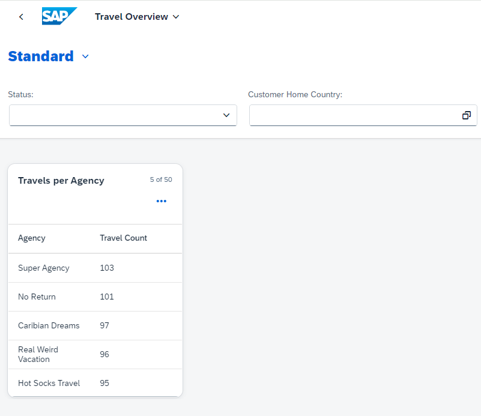

# Add a table card to the Overview Page

### 1. Create CDS View Entity ZRAPH_##_C_OVPTravelsPerAg
Base this new view entity on ZRAPH_##_I_TravelWDTP.  

| Source                              | Field name          | Is key |
| ----------------------------------- | ------------------- | ------ |
| *ZRAPH_##_I_TravelWDTP.*AgencyID    | AgencyID            | Yes    |
| _Agency.Name                        | AgencyName          | No     |
| count( * )                          | TravelsCount        | No     |
  
*AgencyID and _Agency.Name need to be added to a group by clause*  
  
Add the following annotations to provide the metadata for the table:  
  
__AgencyName:__  
```abap
@UI.lineItem: [{
    qualifier: 'Table',
    label: 'Agency',
    position : 1
}]
```
  
__CustomerHomeCountry:__  
```abap
@UI.lineItem: [{
    qualifier: 'Table',
    label: 'Travel Count',
    position : 2
}]
```
  
Activate ZRAPH_##_C_OVPTravelsPerAg.  
  
[__Solution__](./solutions/AddTableCard/ZRAPH_%23%23_C_OVPTravelsPerAg-1.txt)

### 2. Expose ZRAPH_##_C_OVPTravelsPerAg as entity set
Adapt ZRAPH_##_SD_OVP:  

| CDS View Entity            | Entity Set       |
| -------------------------- | ---------------- |
| ZRAPH_##_C_OVPTravelsPerAg | TravelsPerAgency |
  
Activate ZRAPH_##_SD_OVP.  
  
[__Solution__](./solutions/AddTableCard/ZRAPH_%23%23_SD_OVP.txt)

### 3. Add table card to OVP

#### Configure the card

In BAS open file webapp/manifest.json and scroll down to section "sap.ovp".  
Enhance the already existing "cards : {}" entry to the following:  
```json
        "cards": {
            "card00": {
                "model": "mainService",
                "template": "sap.ovp.cards.table",
                "settings": {
                    "title": "{{card00_title}}",
                    "entitySet": "TravelsPerAgency",
                    "addODataSelect": false,
                    "presentationAnnotationPath": "com.sap.vocabularies.UI.v1.PresentationVariant#Table",
                    "annotationPath": "com.sap.vocabularies.UI.v1.LineItem#Table"
                }
            }
        }
```
  
[__Solution__](./solutions/AddTableCard/manifest.json)  
  
#### Define the translatable title text

In BAS open file webapp/i18n/i18n.properties.  
Add the card title as follows:  
```properties
#XTIT: Table Card Title
card00_title=Travels per Agency
```
  
[__Solution__](./solutions/AddTableCard/i18n.properties)  

#### Test the app once more
In BAS again test the App.  
It should now look similar to this:  
  
  
### 4. Let's sort the table by travel count
While we see the data we want in principle, we actually want to see the top 5 agencies as measured by travel count by default.  
Therefore we add some sorting behaviour to our table card.  
#### Add annotations for sorting to the cds view entity
In ZRAPH_##_C_OVPTravelsPerAg, add the following annotation for the whole view entity:  

```abap
@UI.presentationVariant: [
  { qualifier: 'Table', 
    sortOrder: [{
        by:       'TravelsCount', 
        direction :#DESC 
      }]}
]
```
  
Activate ZRAPH_##_C_OVPTravelsPerAg.  
  
[__Solution__](./solutions/AddTableCard/ZRAPH_%23%23_C_OVPTravelsPerAg-2.txt)

#### Test the app once more
In BAS again test the App.  
It should now look similar to this:  
  
  
### 5. Make the filters work
Now when you test the filters in the filter bar, you will notice that this has no impact on the table card.  
This is because the filters are pushed down to all cards via name equality.  
As our filter fields are called "OverallStatus" and "CustomerHomeCountry" and we have no equal field in our ZRAPH_##_C_OVPTravelsPerAg, this equality is not given.  
Therefore we need to add the following field inbetween AgencyName and TravelsCount:  

| Source                                | Field name          | Is key |
| ------------------------------------- | ------------------- | ------ |
| *ZRAPH_##_I_TravelWDTP.*OverallStatus | OverallStatus       | No     |
  
*OverallStatus needs to be added to the group by clause*  
  
Add/Change the following annotations:  
  
__OverallStatus:__  
```abap
@UI.lineItem: [{
    qualifier: 'Table',
    label: 'Status',
    position : 2
}]
```
  
__TravelsCount:__  
```abap
@UI.lineItem: [{
    qualifier: 'Table',
    label: 'Travel Count',
    position : __3__
}]
```
  
In BAS again test the app and check the filters.  
They should now impact the result.  
  
[__Solution__](./solutions/AddTableCard/ZRAPH_%23%23_C_OVPTravelsPerAg-3.txt)
  
  
[<< Previous Step](./CreateInitialOVP.md) | [Next Step >>](./AddListCard.md)
