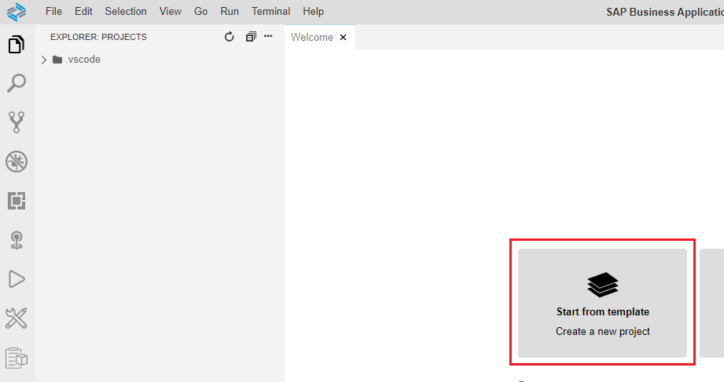
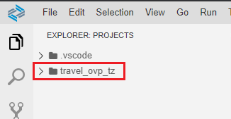
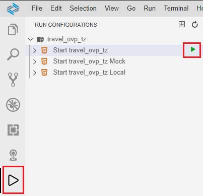
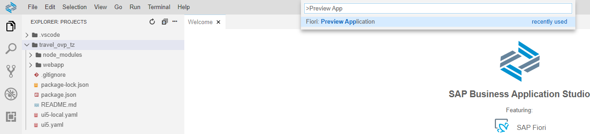

# Create initial Overview Page

### 1. Create the Interface CDS View Entity ZRAPH_##_I_OVPFilter
This CDS View Entity (together with its consumption view) represents the filter options for the Overviewpage.  
We want to filter for the overall status and customers home country.  
  
As primary source for the CDS View Entity we use ZRAPH_##_I_TravelWDTP.  
To get access to the customers home country, we join in /DMO/I_Customer.  
  
Following fields need to be put in the projection list:  

| Source                              | Field name          | Is key |
| ----------------------------------- | ------------------- | ------ |
| ZRAPH_##_I_TravelWDTP.TravelID      | TravelID            | Yes    |
| ZRAPH_##_I_TravelWDTP.OverallStatus | OverallStatus       | No     |
| /DMO/I_Customer.CountryCode         | CustomerHomeCountry | No     |

### 2. Create the Consumption CDS View Entity ZRAPH_##_C_OVPFilter
This CDS View Entity adds annotations for the filtering of the OVP.  
It shall be created as a selection from ZRAPH_##_I_OVPFilter and projects all of its fields.  

### 3. Create the service definition ZRAPH_##_SD_OVP
Expose the following entity:  

| CDS View Entity      | Entity Set |
| -------------------- | ---------- |
| ZRAPH_##_C_OVPFilter | OVPFilter  |
  

### 4. Create the service binding ZRAPH_##_SB_OVP and publish it
Use service definition ZRAPH_##_SD_OVP.  
Use Binding Type: OData V2 - UI.  

### 5. Create Overview Page in Business Application Studio and test it

#### Open the Business Application Studio (BAS).  
Go to [https://hana.ondemand.com](https://hana.ondemand.com).
Sign in to your trial account.  
Enter your trial account using the button "Go To Your Trial Account".  
Enter your trial subaccount.  
On the left pane, click on "Instances and Subscriptions".  
There you should already have one subscription to the SAP Business Application Studio.  
Click on that.  
Choose your devspace (which you should already have created).  

#### Create new project
Click on "Start from template" in the "Welcome"-Tab.  
  
Or press CTRL+SHIFT+P and type "New Project" and select the item "SAP Business Application Studio: New Project from Template".  
  
Choose "SAP Fiori Application" and press the "Start" button below.  
  
As Application type, take "SAP Fiori Elements".  
Press on "Overview Page" and press the "Next" button below.  
  
As data source choose "Connect to a System".  
As system choose your destination, created in previous lessons.  
As service choose the service ZRAPH_##_SB_OVP, that you published earlier.  
Press the "Next" button below.  
  
As filter entity choose the entity OVPFilterType (The "Type" part was added automatically by the system for the OData Service) we defined in the service definition.  
Press the "Next" button below.  
  
As module name choose "travel_ovp_##".  
As application title choose "Travel Overview".  
As namespace choose "com.erp.ovp".  
As description choose "Travel Overview".  
Leave the project folder path at "/home/user/projects".  
Also leave all 3 radio buttons at "No".  
Press the "Finish" button below.  
  
At the right in the project explorer you see a new folder "travel_ovp_##".  
  

#### Test the application
Go to the run configuration pane and press the run button on the first of the 3 automatically created configurations.  
  
Or press CTRL+SHIFT+P and type "Preview App" and select the item "Fiori: Preview Application".  
  
  
Your app should now look like this:  
  
  
If you press on "Adapt Filters", the 3 fields we defined in the Consumption View Entity should be visible.  
  

### 6. Add annotations to CDS View Entity ZRAPH_##_C_OVPFilter and test the app again
Additionally the following annotations have to be added:  

| Field name          | Annotation                                  |
| ------------------- | ------------------------------------------- |
| TravelID            | @UI.hidden: true                            |
| OverallStatus       | @UI.selectionField: `[{ position: 1 }]`     |
|                     | @EndUserText.label: 'Status'                |
| CustomerHomeCountry | @UI.selectionField: `[{ position: 2 }]`     |
|                     | @EndUserText.label: 'Customer Home Country' |

### 7. 

[Next Step >>](./AddTableCard.md)

