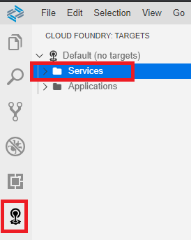

# Create initial Overview Page

### 1. Create the Interface CDS View Entity ZRAPH_##_I_OVPFilter
This CDS View Entity (together with its consumption view) represents the filter options for the Overviewpage.  
We want to filter for the overall status and customers home country.  
  
As primary source for the CDS View Entity we use ZRAPH_##_I_TravelWDTP.  
To get access to the customers home country, we join in /DMO/I_Customer.  
  
Following fields need to be put in the projection list:  

| Source                              | Field name          | Is key |
| ----------------------------------- | ------------------- | ------ |
| ZRAPH_##_I_TravelWDTP.TravelID      | TravelID            | Yes    |
| ZRAPH_##_I_TravelWDTP.OverallStatus | OverallStatus       | No     |
| /DMO/I_Customer.CountryCode         | CustomerHomeCountry | No     |

### 2. Create the Consumption CDS View Entity ZRAPH_##_C_OVPFilter
This CDS View Entity adds annotations for the filtering of the OVP.  
It shall be created as a selection from ZRAPH_##_I_OVPFilter and projects all of its fields.  

### 3. Create the service definition ZRAPH_##_SD_OVP
Expose the following entity:  

| CDS View Entity      | Entity Set |
| -------------------- | ---------- |
| ZRAPH_##_C_OVPFilter | OVPFilter  |
  

### 4. Create the service binding ZRAPH_##_SB_OVP and publish it
Use service definition ZRAPH_##_SD_OVP.  
Use Binding Type: OData V2 - UI.  

### 5. Create Overview Page in Business Application Studio and test it
Open the Business Application Studio (BAS).  

### 6. Add annotations to CDS View Entity ZRAPH_##_C_OVPFilter and test the app again
Additionally the following annotations have to be added:  

| Field name          | Annotation                                  |
| ------------------- | ------------------------------------------- |
| TravelID            | @UI.hidden: true                            |
| OverallStatus       | @UI.selectionField: `[{ position: 1 }]`     |
|                     | @EndUserText.label: 'Status'                |
| CustomerHomeCountry | @UI.selectionField: `[{ position: 2 }]`     |
|                     | @EndUserText.label: 'Customer Home Country' |

### 7. 

[Next Step >>](./AddTableCard.md)

